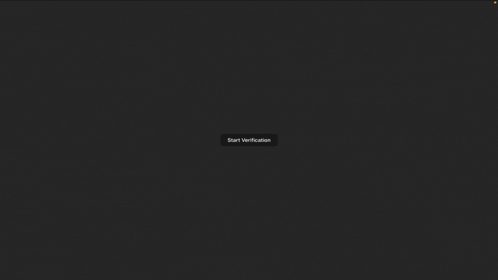

  
  
  

## Plaid Identity Verification w/ React.js & Express.js
Proof of concept application using the Plaid Identity Verification UX in React.js & Express.js

### Node.JS Installation
1. `git clone git@github.com:Innovoeb/plaid_idv.git`
2. `npm i` within root directory of cloned repo 
3. `npm i` within /client directory 
4. `npm i` within /server directory
5. `npm start` within root directory of cloned repo to start the application

Example web app (client) will run on **localhost:5173** while the internal REST api (server) will run on **localhost:3000**

### Resources
